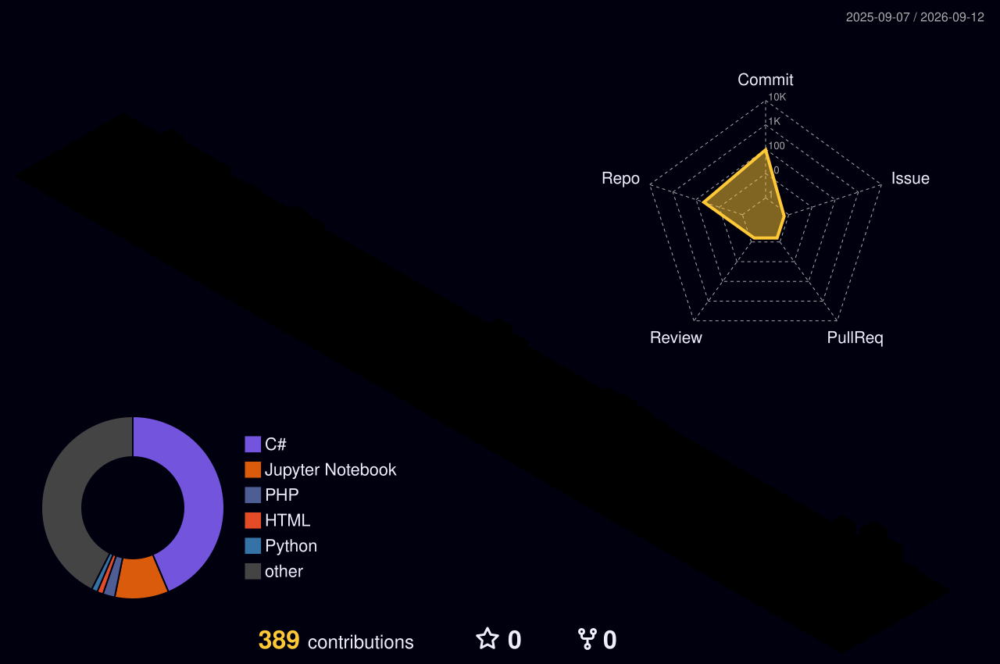

<!--
  GitHub Profile README for https://github.com/Muzaqil555

  Publish:
  1. Create a PUBLIC repo named exactly: Muzaqil555
  2. Push this folder to that repo (main branch)
  3. GitHub → Actions → enable workflows
  4. Run "Generate Snake Animation" and "GitHub Profile 3D Contrib" once
-->

<div align="center">
  

  <a href="https://github.com/Muzaqil555">
    
  </a>

  <p>
    
    
    
  </p>

  <p>
    <a href="mailto:mhesenli7@std.beu.edu.az"></a>
    <a href="https://github.com/Muzaqil555"></a>
    <a href="https://www.linkedin.com/in/muzaqil-hesenli-111837381"></a>
  </p>
</div>

---

### About

Computer Engineering student at **Baku Engineering University**, specializing in **Data Science** and **AI Engineering**. I take messy, real-world data through cleaning, exploratory analysis, modeling, and the engineering required to make those models useful.

I care about signal over noise: clear features, honest evaluation, and systems that can actually run outside a notebook.

- Building end-to-end ML workflows: **EDA → features → models → evaluation**
- Learning to ship AI systems, not only train them
- Strong foundation in **Python**, visualization, and software engineering (**C#**, **C++**)

---

### What I work on

```text
DATA SCIENCE          MACHINE LEARNING         AI ENGINEERING
cleaning & wrangling  classical ML             reproducible pipelines
EDA & storytelling    deep learning            APIs & experiment tracking
feature design        model evaluation         cloud & Azure ML
```

<p align="center">
  
  
  
  
  
  
  
  
  
  
  
  
</p>

<p align="center">
  
</p>

---

### Certifications

- **IBM Data Science Professional Certificate** — 12-course program (Coursera)
- **Python for Data Science, AI & Development** — IBM
- **Tools for Data Science** — IBM
- **Create Machine Learning Models in Microsoft Azure** — Microsoft

---

### Featured work

<div align="center">
  <a href="https://github.com/Muzaqil555/AIA">
    
  </a>
  <a href="https://github.com/Muzaqil555/datavizual">
    
  </a>
</div>

<div align="center">
  <a href="https://github.com/Muzaqil555/finans">
    
  </a>
  <a href="https://github.com/Muzaqil555/python">
    
  </a>
</div>

<p align="center">
  <a href="https://github.com/Muzaqil555/AIA">Applied AI notebooks</a>
  ·
  <a href="https://github.com/Muzaqil555/datavizual">Data visualization</a>
  ·
  <a href="https://github.com/Muzaqil555/finans">Financial data analysis (Tesla)</a>
  ·
  <a href="https://github.com/Muzaqil555/madels">ML models</a>
</p>

---

### GitHub metrics

<div align="center">
  
  
</div>

<br/>

<div align="center">
  
</div>

<br/>

<div align="center">
  
</div>

<br/>

<div align="center">
  
</div>

---

### Contribution snake

<p align="center">
  <picture>
    <source media="(prefers-color-scheme: dark)" srcset="./dist/github-contribution-grid-snake-dark.svg" />
    <source media="(prefers-color-scheme: light)" srcset="./dist/github-contribution-grid-snake.svg" />
    
  </picture>
</p>

### 3D contribution city

<p align="center">
  
</p>

---

### Currently leveling up

```text
[████████████░░░░]  Deep Learning with PyTorch
[██████████░░░░░░]  MLOps — Docker, experiment tracking, deployment
[█████████░░░░░░░]  LLMs & RAG systems
[█████████████░░░]  Azure Machine Learning
```

---

<div align="center">
  <i>From data to models to systems that hold up in the real world.</i>
  <br/><br/>
  
</div>
