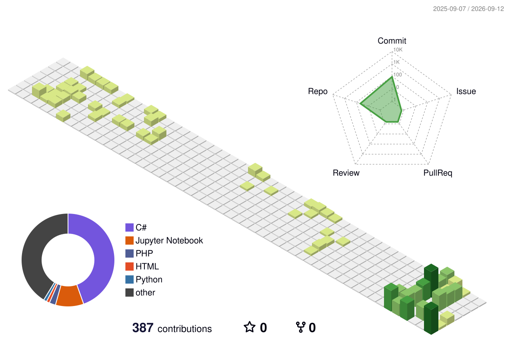

  <h2>MUZAQIL HESENLI</h2>
  <h4>Data Scientist & AI Engineer</h4>
  
  

  

    
    
    
  

---

### 👨‍💻 PROFESSIONAL SUMMARY

Computer Engineering student at Baku Engineering University with a strong foundation in Data Science and AI Engineering. Experienced in taking datasets through cleaning, exploratory analysis, modeling, and evaluation using Python, pandas, NumPy, Matplotlib, Seaborn, and scikit-learn. Work includes subscription churn classification, Tesla and GameStop financial EDA, automobile-sales visualization, and King County house-price analysis, alongside C# coursework. Highly passionate about continuous learning and turning raw data into decisions that hold up.

- [IBM Data Science Professional Certificate](https://www.coursera.org/professional-certificates/ibm-data-science)
- [Python for Data Science, AI & Development](https://www.coursera.org/learn/python-for-applied-data-science-ai)
- [Create Machine Learning Models in Microsoft Azure](https://www.coursera.org/learn/create-machine-learning-models-in-microsoft-azure)

### 🛠️ TECHNICAL ARSENAL

  

  
  
  
  

---

### 📈 CONTRIBUTION METRICS

  
  
  

 

### 🐍 CONTRIBUTION SNAKE

  

### 🌆 3D CONTRIBUTION CITY

  

